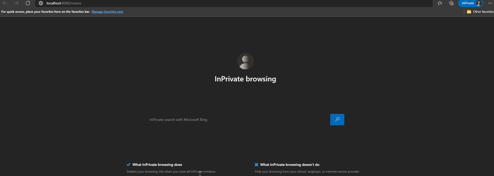
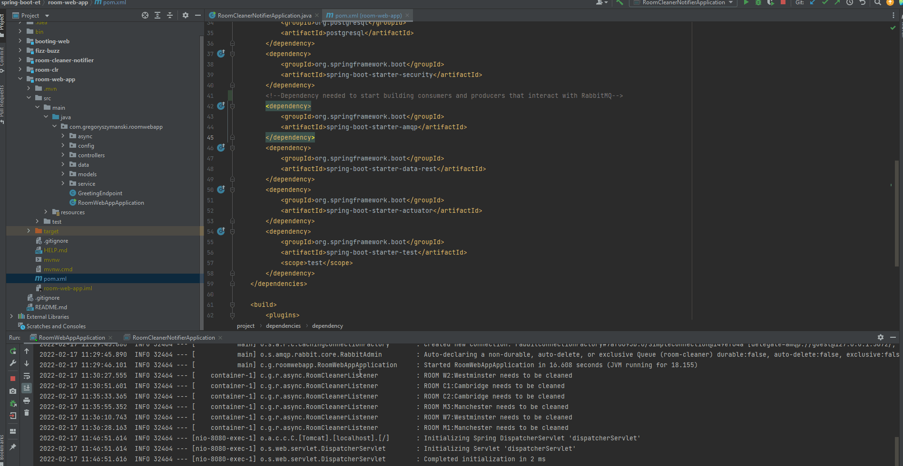

# Spring Boot Essential Training

## Overview

Welcome to one of my practice repositories where I study and share my findings about Spring Boot. 
The base code of this repo is based on a LinkedIn Learning course titled [Spring Boot 2.0 Essential Training](https://www.linkedin.com/learning/spring-boot-2-0-essential-training-2/spring-into-spring?autoAdvance=true&autoSkip=false&autoplay=true&contextUrn=urn%3Ali%3AlyndaLearningPath%3A5b101b04498e06fb6e2d8785&resume=true&u=78163626). 
The author of the course is Frank P Moley III. 
Part of my studies involves following tutorials and courses I can find online that I think I will find useful to learn from. 
I find these kind of study materials useful, especially when it involves some new programming frameworks like Spring. 
Before I jump into building bigger projects, I always like to go over easier demos to get a better feeling of what the framework is offering. 
Frank Moley's course is a great example of that kind of educational content. It offers a great overview of Spring Boot, combining both short-form lectures and code examples. 
You can read my full review about the Spring Boot 2.0 Essential Training, here on my [blog](https://medium.com/@gregoryszy/introduction-3d69f1278f84) on Medium. 
You will see a lot of additional comments over the code. That is my way of taking notes, so I can solidify my understanding about what a specific line of code does and how does it relate to the whole project. 
Over time you can expect me to add additional comments. I will also be adding some new examples while I continue to try different elements of Spring Boot. 
I treat these types of repositories as a playground where I can test new framework features, learn more about how to properly use Github and practice my writing skills. 

## Key Topics

Below are the topics that I have learned from following the Spring Boot 2.0 Essential Training course and reviewing it's coding examples. Whenever I make such lists I like to add questions that I can try to answer whenever I come back to this document:

* Structure of a Spring Boot project
  * How can you easily initilize a Spring Boot projects?
  * What are the main elements of a newly generated Spring Boot projects?
* Configuration in Spring Boot
  * What are the ways a Spring Boot project can be configured? 
* Spring Boot Web
  * What is Spring Boot Web and why is it useful? 
  * How can the MVC pattern be implemented in a Spring Boot project? 
* Spring Boot Command Line
  * What is the CommandLineRunner in Spring Boot? 
  * How can the CommandLineRunner be utilized?
* Spring Boot Data
  * How can Spring Boot Data be utlized to connect an application to a database?
  * What are Spring Data repositories
* Spring Security
  * What is the purpose of Spring Security?
* Spring REST
  * How can Spring REST be utilized to implement REST repositories? 
* Spring Boot and Messageing Systems
  * How can producers and consumers be built for messaging systems using Spring Boot? 
* Spring Boot Actuators
  * What the Actuator allows to monitor?

## Video Examples

Below you can see examples of demos of some features that are possible to implement in Spring Boot, that were covered in the course.
The videos cover the implementation of authentication with Spring Security, displaying rooms and staff data retrieved from a database and displaying it on a page,
simple examples of a Spring producer sending a message to RabbitMQ and having a producer read that message from a queue and showing the result of Spring REST exposing raw data repositories as services.  

### Spring Security and Spring Data - Adding Authentication, Displaying Data from a Database

### Spring Message Consumers and Producers

### Spring Rest Endpoints

## Links

This repository is based on the materials covered in:
[LinkedIn Learning - Spring Boot 2.0 Essential Training](https://www.linkedin.com/learning/spring-boot-2-0-essential-training-2/spring-into-spring?autoAdvance=true&autoSkip=false&autoplay=true&contextUrn=urn%3Ali%3AlyndaLearningPath%3A5b101b04498e06fb6e2d8785&resume=false&u=78163626)  

 
